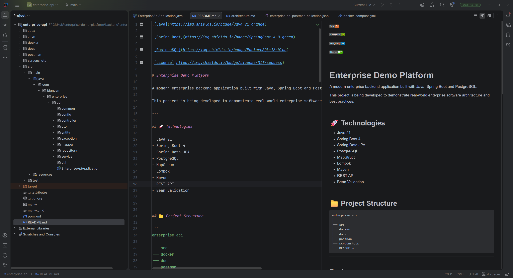

# Enterprise Demo Platform
## 📸 Project Preview



A modern enterprise backend application built with Java, Spring Boot and PostgreSQL.

This project is being developed to demonstrate real-world enterprise software architecture and best practices.

---

## 🚀 Technologies

- Java 21
- Spring Boot 4
- Spring Data JPA
- PostgreSQL
- MapStruct
- Lombok
- Maven
- REST API
- Bean Validation

---

## 📁 Project Structure

```
enterprise-api
│
├── src
├── docker
├── docs
├── postman
├── screenshots
└── README.md
```

---

## Features

### Department Module

- Create Department
- Get Department
- Get All Departments
- Update Department
- Delete Department

### Employee Module

- Create Employee
- Get Employee
- Get All Employees
- Update Employee
- Delete Employee

---

## API Examples

### Create Department

POST

```
/api/departments
```

Request

```json
{
  "name": "IT",
  "description": "Information Technology"
}
```

---

### Create Employee

POST

```
/api/employees
```

```json
{
  "firstName": "Bilgin",
  "lastName": "Can",
  "email": "bilgin@example.com",
  "salary": "75000",
  "departmentId": 1
}
```

---

## Validation

Bean Validation is used.

Examples

- Name is required
- Description is required
- Email format
- Maximum field lengths

---

## Exception Handling

A centralized GlobalExceptionHandler is used.

Example response

```json
{
  "message": "Department not found"
}
```

---

## Database

PostgreSQL

Main tables

- departments
- employee

---

## Future Roadmap

- Authentication (JWT)
- Role Based Authorization
- Swagger / OpenAPI
- Docker
- Unit Tests
- Integration Tests
- Pagination
- Sorting
- Filtering
- Audit Logging
- CI/CD

---

## Author

Bilgin Can

Senior Full Stack Developer

Java • Spring Boot • React • PostgreSQL